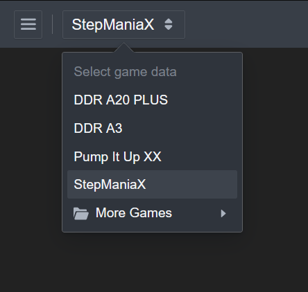
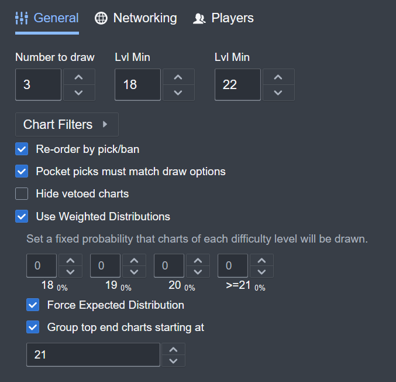
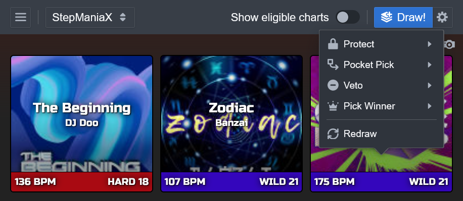
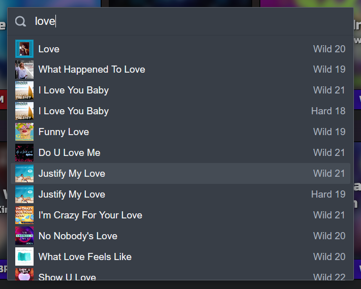
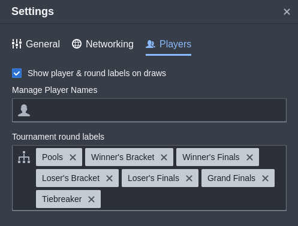
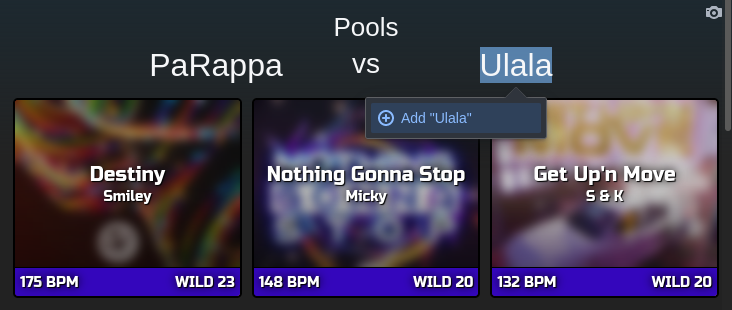
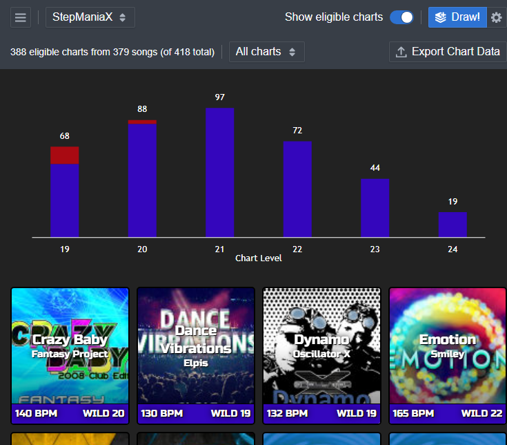
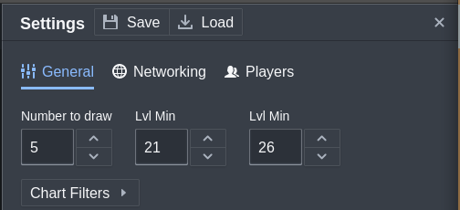

# DDR Tools User Manual

## What is this?

[DDR Tools](https://ddr.tools/) is a versatile web app designed for the needs of the dance game community. That is, fans of _Dance Dance Revolution_ and other similar games.

The app's primary feature is **Card Draw**, or the ability to pull a few random selections from the hundreds of possible songs in the game. This is most often used in tournament play to decide what songs competitors should play when facing off against each other.

It is an offline-enabled PWA, which means:

- After visiting once in any modern browser, most features are usable completely offline.
- Most browsers give you the option to install it as a standalone app ("add to home page" on iOS), letting it exist on its own outside of the browser.

# Card Draw

DDR Tools has song data available from a variety of different games selectable from a menu in the top left, and it can also [import packs from IGT/SM5](#sm5itg-imports). If there are other games you would like to see the app support, [please reach out](#contact)!



## Basics

Clicking "Draw!" in the top right corner will present a random selection charts from the selected game data. Each card can be clicked to access a menu of [actions](#actions).


Draws are not saved anywhere and cannot be recovered after the page is closed or refreshed.

## Settings

The app has many detailed settings giving you fine-grained control over exactly which songs and charts are picked from the selected game. Access the settings drawer with the gear button in the top right.

Some of the less self-explanatory settings are described below.


<dl>
<dt>Reorder by pick/ban
<dd>Moves charts to the beginning or end of the set when charts are protected or vetoed.

<dt>Pocket picks must match draw options
<dd>Limits charts selected in a pocket pick action to those that match current draw settings
</dl>to

The weighted distribution options allows manual control over the probabilities for charts of any specific difficulty level to be drawn.

Without this setting enabled, each individual chart matching the level range and filters has an equal chance of being drawn. In other words, it is equivalent to configuring the "weight" of each difficulty level to the number of possible charts contained within it.

> Consider a hypothetical scenario: The configured settings allow for charts to be drawn with the following counts by difficulty level.
>
> |       Lvl |   Count |
> | --------: | ------: |
> |        18 |      30 |
> |        19 |      30 |
> |        20 |      20 |
> |        21 |      15 |
> |        22 |       5 |
> | **Total** | **100** |
>
> In this scenario there is a 5% chance _any single drawn card_ will be a lvl 22 chart. In a single 3 card draw, there will be a 14.4% chance of seeing at least one 22.
>
> For the curious, I have another page with much more on [the probability math behind card draw](probabilities.md).



The weighted distribution options allows you to replace the natrual chances of specific levels with artificial ones. The calculated chance of _any single drawn card_ being drawn at a specific difficulty level is displayed next to the corresponding input.

<dl>
<dt>Force Expected Distribution
<dd>Reduces randomness by preventing any outlier draws that contain more than the expected number of charts of each difficulty level. (e.g. For the above example, this would limit a 3 card draw to either zero or one level 22 chart.)

<dt>Group Top End Charts
<dd>Allows grouping charts of multiple levels into a single "bucket". This helps when you want a higher probability of hard stuff, but your game of choice has a very limited number of charts at the highest levels.
</dl>

## Actions

Clicking any drawn card will open a menu of actions that can update the state of the card.



<dl>
<dt>Protect and Veto (Pick/Ban)
<dd>
Tournaments often provide players some choice in which songs are played using protect and veto actions. By default, a protect will move the chart to the beginning of the set, and a veto will move it to the end. A tag will be left on the card indicating which player took the action.
<dt>Redraw
<dd>Replaces the selected card with a new one, randomly selected according to the current settings. When used with weighted distributions, the "Force expected distribution" option is not applied to the redraw. (It does not take into account the other songs already in the set, instead treating it as a standalone single-card draw.)

<dt>Pick Winner
<dd>Leaves a tag on the card to indicate which player was victorious. This is the only action that can be taken on cards that already have been protected or replaced by a pocket pick.

<dt>Pocket Pick
<dd>
Some tournaments may also a "pocket pick" where a players freely picks a chart of their choice to replace one of the drawn cards. Upon selecting this action, a search overlay opens to quickly find the intended song. This also leaves a tag on the card indicating the acting player.



</dl>

# Networking

Multiple copies of the app can connect over the internet to share drawn sets of cards between devices. This can be especially useful for larger events, sharing drawn cards with an audience of spectators, etc.

See: [Networking](networking.md)

# Other Features

## Player Labels

The settings drawer also contains a tab for player and tournament round labels, along with the option to pre-populate player and round names ahead of time in settings. The inputs there accept comma or line break separated name imports from external data sources.



Once enabled, labels appear above each drawn set of cards. Players and round names can be freely entered or you can select from any names previously enetered (in settings and from previous draws).



## Preview Eligible Charts

A toggle to "Show eligible charts" is included at the top (in the settings drawer for mobile devices) and can be useful for multiple reasons. First and foremost, it allows easy review of the current song data and helps catch issues. Any special song categories like "Unlockable songs" can be shown separately to confirm the appropriate categorization.

Second, a color-coded histogram is displayed at the top to provide a quick summary of the over-all difficulty pool included by the current settings. This can also be handy to summarize an entire game's song library by using the settings to include all charts.



## Save as Image

Each drawn set has a camera icon in the top right. This saves an image of the current set with a transparent background suitable for use in stream layouts and other such designs. Resize your browser window to adjust the aspect ratio of the generated image.

## Save/Load Settings

Buttons at the top of the settings drawer will allow you to save and load settings for the card draw in a JSON file format. These can be hand-edited as needed, and shared between devices.



## Use as OBS Layer

The app is aware of when it is loaded into an OBS Browser Source and will automatically remove its own background elements to better blend into a stream layout. (I recommend cropping out the top toolbar.) DDR Tools is fully usable within the browser source "Interact" window, but real pros use the [networking features](networking.md) to remotly control their browser sources.

## SM5/ITG imports

Custom builds with data files based on ITG song packs are trivial to prepare. The only requirements are a working installation of `node.js` and `yarn`, and a copy of this project.

In a terminal:

```sh
# Switch directories into the project
cd DDRCardDraw

# Install project dependencies
yarn

# import a local ITG/StepMania song pack into a song data file
# providing a stub name without spaces
yarn import:itg path/to/pack/folder some-stub-name

# then you have a choice of either of the following:

# start a local development server.
# card draw will be available at http://localhost:8080
yarn start

# prepare a build usable elsewhere
# static HTML/CSS/JS output in dist/* can be hosted anywhere
yarn build
```

# Contact

DDR Tools is primarily developed by me, Noah Manneschmidt, aka Cathadan. I'm open to contact on a variety of platforms:

- [DDR Tools Discord](https://discord.gg/QPyEATsbP7)
- [Facebook Messenger](https://m.me/noah.manneschmidt)
- [The Fediverse](https://mastodon.content.town/@noahm)
- Here on Github, via Discussions, Issues, or Pull Requests
